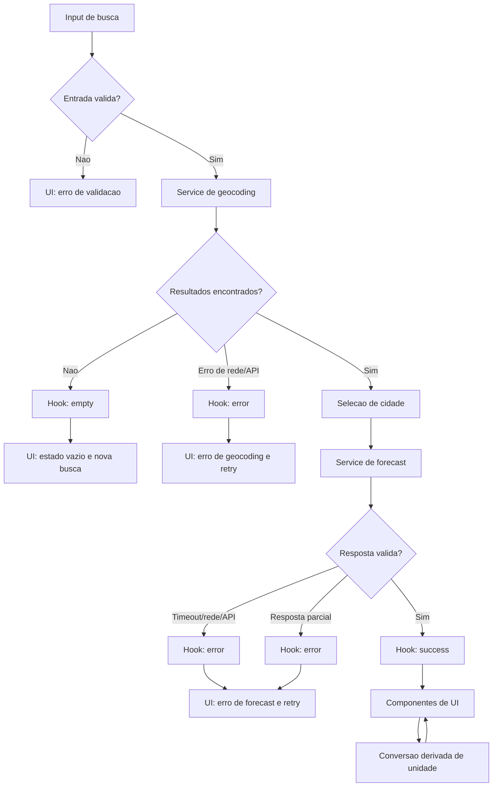

# Weather App — Plano Técnico

Este plano deriva de `specs/weather-app-spec.md` e define decisões de
arquitetura, contratos e estratégia de validação para o MVP. Ele não define a
implementação final. As decisões marcadas como pendentes dependem das Open
Questions da spec e devem ser resolvidas antes da quebra final de tarefas.

## 1. Architecture

### Visão geral

A aplicação será uma SPA React executada no navegador, organizada em quatro
camadas simples, com dependências apontando para baixo:

1. **Apresentação (`components/`):** componentes React para busca, seleção de
  cidade, loading, erro, estado vazio, clima atual, previsão diária e unidade.
  Recebe estado e callbacks; não conhece HTTP nem regras de negócio externas.
2. **Orquestração e estado (`hooks/`):** hooks coordenam busca, seleção,
  previsão, retry, concorrência e transições de estado. Conhecem os contratos
  dos services, mas não renderizam markup.
3. **Acesso a dados (`services/`):** clientes da Open-Meteo fazem requisições,
  timeout, parsing, validação de schema e normalização para os modelos internos.
  Não dependem de componentes React.
4. **Funções puras (`lib/`):** conversão de unidades, datas, códigos
  meteorológicos, validações e normalização de erros. Não fazem I/O, não usam
  estado React e recebem todos os dados por parâmetro.

Tipos compartilhados em `types/` sustentam os contratos entre as camadas, mas
não contêm comportamento nem chamadas externas.

Fluxo arquitetural:

```text
Usuário
  ↓ interação
React UI
  ↓ eventos
Weather query hook
  ↓ chamadas tipadas
Geocoding service ──→ Open-Meteo Geocoding API
Forecast service  ──→ Open-Meteo Forecast API
  ↓ respostas validadas
Domínio normalizado
  ↓ estado
React UI
```

### Decisões

- Não haverá backend próprio no MVP; as chamadas serão feitas pelo cliente para
  a API pública aprovada.
- Os componentes não conhecerão URLs nem o formato bruto da Open-Meteo.
- Os componentes não importarão `services`; recebem dados e callbacks do hook.
- Os hooks não formatarão respostas brutas da API; essa responsabilidade fica
  nos services e em funções puras de `lib/`.
- Os services não importarão React, componentes ou hooks.
- Funções de `lib/` serão determinísticas e não terão efeitos colaterais.
- O serviço converterá respostas externas para modelos internos antes de
  atualizar a UI.
- Toda consulta terá um identificador ou mecanismo equivalente para que uma
  resposta antiga não substitua o resultado da busca mais recente (EC-08).
- A interface terá estados explícitos `idle`, `loading`, `success`, `empty` e
  `error`, evitando telas em branco (FR-06, FR-07, FR-08 e FR-09).

## 2. Tech Stack

| Área | Tecnologia | Decisão |
| --- | --- | --- |
| Linguagem | TypeScript strict | Tipos compartilhados e contratos explícitos. |
| UI | React + Vite | Compatível com a estrutura existente e suficiente para uma SPA simples. |
| Estilo | Tailwind CSS | Responsividade, estados visuais e convenções já definidas no projeto. |
| Dados | `fetch` encapsulado em services | Evita dependência adicional para duas integrações HTTP simples. |
| Estado | React state + hook próprio | O estado é local à aplicação e não justifica biblioteca global. |
| Testes unitários | Vitest + Testing Library | Testar domínio, services mockados e comportamento de componentes. |
| Testes E2E | Playwright | Validar fluxos reais em viewports e estados de API interceptados. |
| Qualidade | Biome | Lint e formatação conforme a configuração existente. |
| Pacotes | pnpm | Gerenciador definido pelo projeto. |

Não serão adicionados Redux, React Query, backend, banco de dados, autenticação
ou biblioteca de componentes no MVP. Essas ferramentas aumentariam a superfície
sem resolver uma necessidade presente na spec.

## 3. Project Structure

```text
src/
  components/
    SearchForm.tsx
    LocationResults.tsx
    WeatherCurrent.tsx
    ForecastList.tsx
    TemperatureUnitToggle.tsx
    AppStatus.tsx
  hooks/
    useWeatherSearch.ts
  services/
    openMeteoGeocoding.ts
    openMeteoForecast.ts
    http.ts
  lib/
    temperature.ts
    dates.ts
    weatherCodes.ts
    validation.ts
  types/
    weather.ts
    api.ts
    errors.ts
  App.tsx
  main.tsx

tests/
  unit/
    temperature.test.ts
    dates.test.ts
    openMeteoGeocoding.test.ts
    openMeteoForecast.test.ts
    useWeatherSearch.test.ts
  e2e/
    weather-search.spec.ts
```

Responsabilidades e limites:

- `components/`: renderização, semântica, acessibilidade e eventos; não fazem
  chamadas HTTP nem calculam regras meteorológicas.
- `hooks/`: transição entre estados e coordenação das chamadas; não renderizam
  UI nem conhecem detalhes de JSON externo.
- `services/`: integração, timeout, parsing e validação da API; não contêm
  estado de tela nem dependem de React.
- `lib/`: funções puras para conversão, datas, códigos e validação; são fáceis
  de testar com entradas e saídas determinísticas.
- `types/`: contratos internos e formatos externos mínimos necessários; não
  possuem efeitos colaterais.
- `tests/`: testes focados por camada, com mocks de rede e fixtures estáveis.

### Como a separação facilita os testes

- `components/` pode ser testado com Testing Library fornecendo props e mocks
  de callbacks, sem rede real.
- `hooks/` pode receber services mockados e ter suas transições verificadas,
  incluindo loading, retry, erro e descarte de respostas obsoletas.
- `services/` pode ser testado com `fetch` interceptado, fixtures da Open-Meteo
  e casos de HTTP, timeout e resposta parcial.
- `lib/` pode ser coberto por testes unitários puros, sem DOM, React ou rede.
- E2E valida somente o fluxo integrado, interceptando a API no Playwright; isso
  evita que testes de apresentação dependam da disponibilidade externa.

Os nomes são uma proposta de decomposição; a tarefa deve preservar a regra da
spec de um componente por arquivo e separação entre UI e acesso a dados.

## 4. Data Model

Os modelos internos abaixo são contratos conceituais. Os campos marcados como
dependentes da decisão de produto não devem ser considerados aprovados até que
as Open Questions 1 e 2 sejam resolvidas.

### Localidade

```ts
interface City {
  id: number // Identificador retornado pelo geocoding.
  name: string // Nome da cidade ou localidade.
  latitude: number // Latitude usada na consulta de previsão.
  longitude: number // Longitude usada na consulta de previsão.
  country: string // Nome do país.
  countryCode: string // Código ISO do país, quando retornado.
  region?: string // Estado, província ou região administrativa.
  timezone?: string // Fuso horário da localidade.
  elevationMeters?: number // Elevação em metros, quando disponível.
}
```

O contrato mínimo é `id`, `name`, `latitude`, `longitude`, `country` e
`countryCode`. `region`, `timezone` e `elevationMeters` são opcionais porque a
Open-Meteo pode não fornecê-los em todos os resultados.

### Clima atual

```ts
interface CurrentWeather {
  temperatureCelsius: number // current.temperature_2m, normalizada para Celsius.
  weatherCode: number // current.weather_code, código WMO da condição.
  observedAt: string // current.time, em ISO 8601 ou formato documentado.
  isDay: boolean // current.is_day, 1 para dia e 0 para noite.
  apparentTemperatureCelsius?: number // current.apparent_temperature, opcional.
  relativeHumidityPercent?: number // current.relative_humidity_2m, opcional.
  precipitationMm?: number // current.precipitation, opcional.
  windSpeedKmh?: number // current.wind_speed_10m, opcional.
}
```

`temperatureCelsius`, `weatherCode`, `observedAt` e `isDay` formam o núcleo
proposto para FR-03. Os demais campos dependem da decisão de produto sobre
métricas adicionais e podem permanecer ausentes.

### Previsão diária

```ts
interface ForecastDay {
  date: string // daily.time, no fuso horário da cidade.
  weatherCode: number // daily.weather_code, código WMO da condição.
  temperatureMinCelsius: number // daily.temperature_2m_min, em Celsius.
  temperatureMaxCelsius: number // daily.temperature_2m_max, em Celsius.
  precipitationProbabilityPercent?: number // daily.precipitation_probability_max.
  precipitationSumMm?: number // daily.precipitation_sum, opcional.
  windSpeedMaxKmh?: number // daily.wind_speed_10m_max, opcional.
  sunrise?: string // daily.sunrise, quando incluído no contrato.
  sunset?: string // daily.sunset, quando incluído no contrato.
}

interface WeatherData {
  city: City // Localidade selecionada pelo usuário.
  current: CurrentWeather // Condição atual normalizada.
  forecast: ForecastDay[] // Hoje e os quatro dias seguintes.
  timezone: string // Fuso usado para datas e “hoje”.
  fetchedAt: string // Momento em que os dados foram obtidos.
}

type Unit = "celsius" | "fahrenheit"
```

`forecast` deve conter exatamente cinco itens após a normalização. Os campos
diários opcionais só devem ser solicitados e exibidos se forem aprovados na
Open Question 2.

### Estado da consulta

```ts
interface WeatherQueryState {
  status: "idle" | "loading" | "success" | "error" | "empty"
  query: string // Texto atual do campo de busca.
  cities: City[] // Resultados de geocodificação para seleção.
  selectedCity?: City // Cidade escolhida para a previsão.
  weather?: WeatherData // Dados válidos da consulta selecionada.
  error?: AppError // Erro normalizado para apresentação.
  unit: Unit // Unidade de exibição atual.
}
```

### Erro normalizado

```ts
interface AppError {
  kind: "validation" | "not-found" | "timeout" | "network" |
        "http" | "invalid-response" | "unknown"
  userMessage: string // Mensagem segura e localizada para o usuário.
  retryable: boolean // Indica se a UI deve oferecer nova tentativa.
}
```

O componente de UI recebe `userMessage` e `retryable`; detalhes técnicos ficam
fora da apresentação.

### Contrato de unidade

Os serviços trabalham com Celsius como unidade canônica. A conversão para
Fahrenheit ocorre no domínio ou na apresentação, sem uma nova chamada HTTP:

```text
fahrenheit = celsius * 9 / 5 + 32
```

A precisão e o arredondamento devem ser definidos antes dos testes numéricos,
conforme a sugestão da revisão da spec.

## 5. Data Flow

1. O usuário digita uma localidade no `SearchForm`.
2. O hook valida texto vazio/espaços; entradas inválidas terminam localmente
   com `validation`, sem chamada à API (FR-07).
3. O hook cancela ou invalida a consulta anterior e entra em `loading`, com a
  operação atual identificada internamente como busca de cidades.
4. `geocodingService.search(query)` chama a API e retorna `City[]` já
   normalizado.
5. Lista vazia termina em `empty`; múltiplos resultados ficam disponíveis para
  seleção; a cidade válida é selecionada explicitamente antes do forecast.
6. Ao selecionar uma `City`, o hook permanece em `loading`, agora com a
  operação interna de previsão, e chama `forecastService.getForecast(city)`.
7. O service valida campos obrigatórios, normaliza datas no timezone retornado e
   garante cinco itens diários.
8. Resposta válida termina em `success` e alimenta `WeatherCurrent` e
   `ForecastList`.
9. Ausência de campo obrigatório, timeout, rede ou HTTP termina em `error` com
   `AppError` e retry quando aplicável.
10. O controle de unidade altera apenas a projeção exibida dos valores; o
    modelo canônico continua em Celsius.

O resultado de uma requisição antiga deve ser descartado quando já existir uma
consulta mais recente, atendendo EC-08 e evitando race conditions.

### Diagrama do fluxo



## 6. External APIs

### Geocoding Open-Meteo

- **Base:** `https://geocoding-api.open-meteo.com/v1/search`
- **Método:** `GET`
- **URL proposta:**
  `https://geocoding-api.open-meteo.com/v1/search?name={query}&count=10&language=pt&format=json`
- **Parâmetros relevantes:**
  - `name={query}`: texto informado pelo usuário.
  - `count=10`: limite de opções para uma busca ambígua.
  - `language=pt`: idioma preferencial dos nomes retornados.
  - `format=json`: formato da resposta.
- **Resposta usada:** lista de localidades com nome, região/país, latitude,
  longitude e timezone quando disponível.
- **Exemplo resumido:**

  ```json
  {
    "results": [
      {
        "id": 3450554,
        "name": "Rio de Janeiro",
        "latitude": -22.9068,
        "longitude": -43.1729,
        "elevation": 6,
        "country_code": "BR",
        "country": "Brasil",
        "admin1": "Rio de Janeiro",
        "timezone": "America/Sao_Paulo"
      }
    ]
  }
  ```

- **Mapeamento para `City`:** `id` → `id`; `name` → `name`; `latitude` e
  `longitude` são preservados; `country` → `country`; `country_code` →
  `countryCode`; `admin1` → `region`; `timezone` → `timezone`; `elevation` →
  `elevationMeters`.
- **Busca vazia:** não chamar o endpoint para input vazio ou apenas espaços.
- **Lista vazia:** retornar estado `empty`, sem chamar a previsão.

### Forecast Open-Meteo

- **Base:** `https://api.open-meteo.com/v1/forecast`
- **Método:** `GET`
- **URL proposta:**
  `https://api.open-meteo.com/v1/forecast?latitude={latitude}&longitude={longitude}&current=temperature_2m,weather_code,is_day,apparent_temperature,relative_humidity_2m,precipitation,wind_speed_10m&daily=weather_code,temperature_2m_min,temperature_2m_max,precipitation_probability_max,precipitation_sum,wind_speed_10m_max,sunrise,sunset&forecast_days=5&timezone=auto&temperature_unit=celsius&wind_speed_unit=kmh`
- **Parâmetros relevantes:**
  - `latitude` e `longitude`: coordenadas da `City` selecionada.
  - `current`: campos do clima atual usados em `CurrentWeather`.
  - `daily`: séries diárias usadas em `ForecastDay`.
  - `forecast_days=5`: solicita hoje e os quatro dias seguintes.
  - `timezone=auto`: retorna datas e horários no fuso da coordenada.
  - `temperature_unit=celsius`: mantém Celsius como unidade canônica.
  - `wind_speed_unit=kmh`: mantém a unidade de vento consistente no modelo.
- A lista de campos em `current` e `daily` é uma proposta técnica mínima; os
  campos opcionais só devem permanecer na URL depois da aprovação das Open
  Questions 1 e 2. O contrato final da API e o modelo devem ser atualizados
  juntos.
- **Resposta usada:** clima atual e séries diárias necessárias para cinco dias.
- **Exemplo resumido:**

  ```json
  {
    "timezone": "America/Sao_Paulo",
    "current": {
      "time": "2026-09-30T12:00",
      "temperature_2m": 24.1,
      "weather_code": 1,
      "is_day": 1,
      "apparent_temperature": 24.5,
      "relative_humidity_2m": 68,
      "precipitation": 0,
      "wind_speed_10m": 12.4
    },
    "daily": {
      "time": ["2026-09-30", "2026-10-01", "2026-10-02", "2026-10-03", "2026-10-04"],
      "weather_code": [1, 2, 3, 61, 0],
      "temperature_2m_min": [19.2, 19.8, 20.1, 18.7, 19.4],
      "temperature_2m_max": [27.3, 28.1, 26.9, 24.5, 27.8],
      "precipitation_probability_max": [10, 20, 40, 70, 5],
      "precipitation_sum": [0, 0.2, 1.5, 8.1, 0],
      "wind_speed_10m_max": [18.0, 20.4, 22.1, 25.0, 16.2],
      "sunrise": ["2026-09-30T05:45", "2026-10-01T05:44", "2026-10-02T05:43", "2026-10-03T05:42", "2026-10-04T05:41"],
      "sunset": ["2026-09-30T17:48", "2026-10-01T17:48", "2026-10-02T17:49", "2026-10-03T17:49", "2026-10-04T17:50"]
    }
  }
  ```

- **Mapeamento para `CurrentWeather`:** `current.temperature_2m` →
  `temperatureCelsius`; `current.weather_code` → `weatherCode`;
  `current.time` → `observedAt`; `current.is_day` → `isDay`; os campos de
  sensação, umidade, precipitação e vento são mapeados para seus equivalentes
  opcionais.
- **Mapeamento para `ForecastDay`:** para cada índice `i`, `daily.time[i]` →
  `date`; `weather_code[i]` → `weatherCode`; os valores min/max →
  `temperatureMinCelsius`/`temperatureMaxCelsius`; as séries de precipitação,
  vento, nascer e pôr do sol → campos opcionais correspondentes.
- **Mapeamento para `WeatherData`:** a `City` selecionada → `city`; o objeto
  `current` normalizado → `current`; os cinco índices de `daily` → `forecast`;
  `timezone` → `timezone`; o horário local da resposta ou do recebimento →
  `fetchedAt`.
- **Validação:** falhar com `invalid-response` se faltar campo obrigatório ou se
  as séries diárias não puderem formar exatamente cinco dias.

### Regras de integração

- URLs e parâmetros devem ficar nos services, nunca nos componentes.
- `fetch` deve tratar HTTP não-2xx como erro normalizado.
- O timeout deve ser implementado no cliente, mas seu valor ainda depende da
  Open Question 4.
- O cliente não deve enviar localização do dispositivo; somente coordenadas
  selecionadas pelo usuário são usadas.
- A API não exige chave no MVP, mas o código deve permitir substituir o cliente
  sem alterar os componentes.

## 7. State Management

O estado vive no hook `useWeatherSearch`, consumido por `App`. Não haverá store
global porque não existe autenticação, persistência, compartilhamento entre
rotas ou múltiplas telas independentes.

### Estados explícitos e transições

`status` usa somente cinco estados de produto:

- **`idle`:** aplicação aberta, sem consulta válida e sem previsão exibida.
- **`loading`:** busca de cidade ou previsão em andamento; dados da consulta
  anterior não são apresentados como resultado atual.
- **`success`:** `WeatherData` validado e pronto para renderização.
- **`error`:** falha de validação, rede, API, timeout ou resposta parcial.
- **`empty`:** busca válida concluída sem cidades compatíveis.

Resultados de geocoding ficam em `cities` enquanto o usuário escolhe uma opção;
isso não cria um sexto status. A seleção de uma cidade inicia novamente
`loading` para carregar a previsão.

```text
idle
  └─ submit(query válida) → loading
loading
  ├─ cidades encontradas → loading (aguarda seleção explícita)
  ├─ lista vazia → empty
  └─ erro → error
loading
  ├─ previsão válida → success
  └─ erro/resposta parcial → error
success
  ├─ nova busca → loading
  └─ troca de unidade → success
empty/error
  ├─ nova busca → loading
  └─ retry → loading
```

Regras:

- `WeatherData` sempre armazena temperaturas em Celsius, a unidade canônica.
- A unidade começa em Celsius e a troca é síncrona, sem rede ou mutação dos
  dados originais.
- A conversão é derivada durante a renderização por uma função pura:
  `displayTemperature(celsius, unit)`. Para Fahrenheit, aplica
  `celsius * 9 / 5 + 32`; para Celsius, retorna o valor original.
- `WeatherCurrent` e `ForecastList` recebem a unidade atual e exibem o valor
  derivado; alternar a unidade não chama os services nem altera `WeatherData`.
- O estado anterior não deve ser exibido como sucesso de outra localidade.
- A query digitada deve ser preservada para nova tentativa.
- Sem persistência entre sessões até que a Open Question 5 seja resolvida.
- Cancelamento de requisição ou request id é obrigatório para evitar resposta
  obsoleta; a escolha da técnica fica no nível do hook/service.

## 8. Error Handling

Toda falha externa é convertida em `AppError` no service e entregue ao hook. O
hook troca o estado para `error`, limpa dados que não possam ser confiáveis e
preserva query/cidade para retry. O componente exibe `userMessage` e um botão
de retry apenas quando `retryable` for verdadeiro.

| Cenário | Estado | Comportamento esperado |
| --- | --- | --- |
| Input vazio ou espaços | `error` (`validation`) | Mensagem em pt-BR, sem chamada de rede, busca disponível. |
| Cidade inexistente ou geocoding vazio | `empty` | Informar ausência de resultados, sem chamar forecast, permitir nova busca. |
| Múltiplos resultados | `loading` | Exibir cidades distinguíveis e aguardar seleção sem chamar forecast antes da seleção. |
| Timeout | `error` | Encerrar loading, informar que o limite foi excedido e oferecer retry. |
| Falha de rede | `error` | Não renderizar dados novos, informar indisponibilidade e oferecer retry. |
| API com HTTP não-2xx | `error` | Normalizar como falha externa, não renderizar resposta e oferecer retry. |
| JSON ou schema inválido | `error` | Rejeitar resposta, não misturar dados parciais com dados antigos e oferecer retry. |
| Busca concorrente | `loading` ou `success` | Aceitar somente a resposta da consulta mais recente. |

O timeout, as mensagens específicas, o número de tentativas e eventual backoff
são dependências explícitas das Open Questions e devem ser definidos antes dos
testes finais. Erros de rede, API, timeout e resposta parcial nunca devem gerar
previsão fictícia nem deixar a tela indefinidamente em `loading`.

## 9. Testing Strategy

### Unitários

- **Funções puras em `lib/`:** testar conversão Celsius/Fahrenheit com valores
  positivos, negativos, zero e decimais; precisão e arredondamento aprovados;
  códigos WMO; formatação de datas no timezone da cidade; janela de hoje mais
  quatro dias; e validação de campos obrigatórios.
- **Services com `fetch` mockado:** testar URL e parâmetros enviados,
  mapeamento de respostas válidas para `City` e `WeatherData`, geocoding sem
  resultados, HTTP não-2xx, falha de rede, timeout, JSON inválido, campos
  ausentes e séries diárias com menos de cinco itens. Nenhum teste unitário de
  service deve depender da Open-Meteo real.
- **Hook `useWeatherSearch`:** testar as transições `idle` → `loading` →
  `success`/`empty`/`error`, seleção de cidade, retry, preservação da query,
  troca de unidade sem novo request e descarte de resposta obsoleta.
- **Componentes com Testing Library:** testar busca e seleção por teclado,
  labels e roles acessíveis, além dos estados `idle`, `loading`, `error`,
  `empty` e `success`. Verificar mensagens, botão de retry, ausência de dados
  fictícios e alteração visual da unidade sem chamada de rede.
- **Cobertura de contrato:** cada caso deve referenciar o `FR`/`AC` coberto;
  campos dependentes de Open Questions ficam pendentes até o contrato ser
  aprovado.

### E2E com Playwright

Interceptar as chamadas à Open-Meteo para tornar os cenários determinísticos e
validar o comportamento integrado entre componentes, hook e services:

1. Estado inicial sem previsão e busca sem autenticação.
2. Busca válida, seleção de resultado e previsão de cinco dias.
3. Busca com múltiplos resultados e seleção correta das coordenadas.
4. Input vazio sem chamada de rede.
5. Geocoding sem resultados.
6. Falha de API, timeout e retry.
7. Resposta parcial rejeitada sem exibição de dados incompletos.
8. Alternância Celsius/Fahrenheit sem nova chamada de forecast.
9. Race condition entre duas buscas, mantendo apenas a mais recente.
10. Fluxo principal por teclado e mensagens/estados acessíveis.
11. Alternância Celsius/Fahrenheit sem nova chamada de forecast e valores
  renderizados conforme a unidade.
12. Viewport mobile: busca, seleção, leitura de clima, previsão e retry sem
  overflow horizontal, sobreposição ou controles inacessíveis.
13. Viewports tablet e desktop definidos na matriz de suporte, quando essa
  matriz for aprovada.

O Playwright não deve repetir todos os casos numéricos já cobertos por Vitest;
deve confirmar que os contratos se comportam corretamente no navegador. Os
testes E2E usarão fixtures controladas para sucesso, vazio, erro e resposta
parcial, mantendo somente um smoke test opcional contra a API real.

### Rastreamento

Cada teste deve referenciar pelo menos um ID da spec (`US`, `FR`, `AC` ou
`NFR`). Os cenários dependentes de decisões em aberto devem permanecer como
testes pendentes até que o contrato correspondente seja aprovado.

## 10. Risks & Trade-offs

| Risco ou trade-off | Decisão | Consequência e mitigação |
| --- | --- | --- |
| Dependência direta da Open-Meteo | Usar services isolados e fixtures nos testes | Simples e sem backend, mas requer tratamento de indisponibilidade e possível troca futura de provider. |
| Métricas meteorológicas ainda abertas | Propor contrato mínimo e bloquear campos extras | Evita over-engineering, mas exige fechar as Open Questions antes da implementação final. |
| Estado local em vez de biblioteca global | Usar hook único | Menor complexidade; revisar somente se surgirem múltiplas telas ou persistência. |
| Sem cache no primeiro corte | Não adicionar cache até decisão de produto | Reduz inconsistência e código; pode aumentar latência e chamadas em redes ruins. |
| Chamadas do browser para API pública | Evitar backend/proxy | Entrega rápida, mas deixa a experiência dependente de CORS, rede e disponibilidade externa. |
| Validação de schema no cliente | Rejeitar respostas parciais | Evita dados enganadores, mas exige contrato atualizado quando campos do MVP forem decididos. |
| Sem autenticação e persistência | Manter MVP stateless | Atende o escopo, mas não suporta favoritos, histórico ou preferências entre sessões. |
| Acessibilidade e layout no mesmo fluxo | Critérios e testes separados por NFR | Reduz regressões, mas requer matriz de browsers/viewports ainda pendente. |

### Alternativas consideradas

- **React Query ou Redux versus hook local:** bibliotecas globais facilitariam
  cache, invalidação e compartilhamento, mas adicionariam complexidade para uma
  única tela sem persistência. Foram adiadas até existir necessidade real.
- **Backend/proxy versus `fetch` direto:** um backend esconderia a API e
  centralizaria cache e retries, mas exigiria infraestrutura fora do escopo.
  O MVP usa `fetch` encapsulado e deixa a troca de provider isolada nos services.
- **Cache local versus nenhuma persistência:** cache reduziria latência e
  chamadas repetidas, mas introduziria expiração e risco de dados obsoletos.
  A primeira versão não usa cache até a decisão da Open Question 6.
- **Mocks unitários versus MSW:** mocks diretos de `fetch` são suficientes para
  os services pequenos; MSW seria uma alternativa útil se a quantidade de
  endpoints ou fluxos de integração crescer.
- **E2E contra API real versus interceptação Playwright:** API real validaria a
  integração externa, mas produziria testes lentos e instáveis. A suíte usa
  interceptação determinística e reserva a API real para smoke test opcional.
- **Schema validator externo versus validação manual:** uma biblioteca de
  schema aumentaria segurança contra respostas mutáveis, mas adicionaria uma
  dependência. A validação manual permanece adequada enquanto o contrato for
  pequeno; revisar se a Open-Meteo ampliar o payload obrigatório.

### Gate antes da implementação

Antes de transformar este plano em tarefas finais, devem ser resolvidas as
Open Questions 1, 2, 3, 4, 5, 6, 7 e 8 da spec, pois elas alteram contratos,
testes ou critérios verificáveis. As questões 9 e 10 podem ser tratadas como
documentação e priorização de produto, sem bloquear o primeiro esqueleto
técnico.

Antes de concluir qualquer implementação, também devem passar os comandos
definidos pelo projeto: `pnpm lint`, `pnpm build` e `pnpm test`.

## 11. Plan Review

### Cobertura da spec

O plano cobre os 12 requisitos funcionais: busca e seleção de cidade, clima
atual, previsão de cinco dias, conversão de unidade, estados de loading/erro/
vazio/inicial, responsividade, ausência de autenticação e pt-BR. Também cobre
os caminhos de API, timeout, resposta parcial, concorrência e retry previstos
nos Edge Cases.

### Decisões ainda faltantes

- Métricas obrigatórias de `CurrentWeather` e `ForecastDay`.
- Tipos de localidade aceitos pela busca.
- Timeout, número de retries e eventual backoff.
- Browsers, versões, viewports e critérios mensuráveis de acessibilidade.
- Persistência da unidade e eventual cache.
- Métricas de sucesso do MVP.

Essas decisões permanecem como gate porque alteram o contrato, a URL da
Open-Meteo ou os testes. O plano usa contratos mínimos provisórios sem
apresentá-los como decisões de produto já aprovadas.

### Over-engineering evitado

Não há necessidade atual de Redux, React Query, backend, banco, autenticação,
cache ou schema validator externo. O hook local, services isolados, funções
puras e fixtures de teste são suficientes para uma única tela sem persistência.
Essas alternativas só devem ser reavaliadas se o escopo ganhar múltiplas telas,
usuários autenticados, cache obrigatório ou novos providers.

### Conformidade com as instruções do projeto

- Mantém TypeScript strict, React/Vite, Tailwind, Vitest, Testing Library,
  Playwright, pnpm e Biome.
- Mantém componentes em `src/components/`, hooks em `src/hooks/`, services em
  `src/services/`, tipos em `src/types/` e funções puras em `src/lib/`.
- Preserva loading, erro e vazio como estados explícitos.
- Define roles/labels, teclado e testes de acessibilidade como parte do plano.
- Não gera código final; os blocos TypeScript são contratos de dados para a
  etapa posterior de implementação.

### Correções aplicadas nesta revisão

- Entrada vazia agora é `error` com `kind: "validation"`, sem criar um estado
  adicional fora do conjunto `idle`, `loading`, `success`, `error` e `empty`.
- A seleção da cidade é explícita antes da chamada de forecast; o plano não
  presume seleção automática para um único resultado.
- Campos opcionais da URL do forecast estão condicionados à aprovação das
  métricas da spec.
- O checklist de entrega `pnpm lint`, `pnpm build` e `pnpm test` foi incluído.